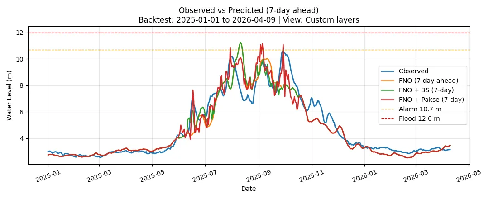

Mekong water level forecast (Stung Treng) with FNO.

# Mekong FNO — Upstream-Assisted Water Level Forecasting System for Stung Treng

## A deployable station-level forecasting and evaluation system for Mekong water levels, combining an FNO-based data-driven core with hydrology-informed upstream correction, long-range backtesting, availability-aware diagnostics, and operational routing.

## Quick Links
- **Live Space:** [Open the live application](https://huggingface.co/spaces/mrcmekong/mekong_fno)
- **Results Summary:** [Evaluation comparison report](assets/reports/eval_compare.json)
- **Repository:** [GitHub](https://github.com/aten2001/mekong_fno)
- **Automation / Update Pipeline:** [Scheduled backfill publishing workflow](https://github.com/aten2001/mekong_fno/blob/main/.github/workflows/publish_backfill.yml)

## Project Snapshot
- **Task:** Daily station-level water-level forecasting and evaluation for the Mekong River.
- **Target station / region:** Stung Treng (014501), Mekong mainstem.
- **Forecast horizon:** Next 7 days for live forecasting; 1–7 day ahead backtesting in the evaluation view.
- **Raw data sources:** Historical station series stored in the repository, combined at runtime with recently updated API-fetched daily values.
- **Current system status:** Deployed on Hugging Face Spaces with persistent runtime storage, reload support, backtesting since 2025-01-01, persistence / assist comparison, and advanced availability-aware diagnostics in the UI.
- **Core capabilities:** Live forecast, long-range backtesting, RMSE-focused evaluation summary, persistence baseline comparison, 3S/Pakse upstream-assisted correction, common-date fair comparison, source-availability summary, operational routing evaluation, uncertainty display, runtime cache/artifact management, and reloadable model/data service.

---

## 1. Project Background

### 1.1 Problem Context
This project focuses on station-level water-level forecasting for the Mekong River, with Stung Treng as the current target station. The system is intended to support practical daily interpretation rather than remain an offline research-only artifact.

### 1.2 Practical Motivation
A useful station-level forecasting application should support straightforward inspection, verification, and refresh workflows.

### 1.3 Project Objective
The goal is not only to train a forecasting model, but to deliver a complete applied ML system that can be deployed, reloaded, backtested, and inspected through a lightweight web interface.

---

## 2. Project Relevance

### 2.1 More Than an Offline Experiment
This repository is not just a notebook or a static model checkpoint. It includes a working Gradio application, a deployed Hugging Face Space, persistent runtime behavior, reload support, model/data caching, and evaluation interfaces designed for repeated operational use rather than one-off offline inspection.

### 2.2 Relevance for Real Forecasting Use
This system is designed for station-level short-term forecasting and interpretation. It supports both forward-looking prediction and retrospective 1–7 day-ahead backtesting, and it exposes uncertainty, persistence comparison, upstream-assisted variants, availability-aware diagnostics, and routing-oriented evaluation so that forecasts can be inspected, compared, and validated in a practical operational workflow.
Rather than replacing basin-scale planning or process-based modeling platforms, it is better understood as a station-level operational supplement: its relative strengths are short-horizon prediction, rapid refresh, strong-baseline comparison, upstream-assisted correction, and user-facing verification.

### 2.3 Relevance as an Applied AI / ML Portfolio Project
This project demonstrates end-to-end applied ML work in a real deployment-oriented setting: data ingestion from historical and recently updated sources, model loading and inference, backtesting, baseline and assisted comparison, uncertainty presentation, runtime/cache/artifact design, reloadable service behavior, and hosted delivery through Hugging Face Spaces. 
It is not presented as a replacement for large-scale mechanistic water-resource platforms, but as a deployable, verifiable, data-driven operational supplement for short-horizon station-level forecasting.

## 3. System Capabilities 
This system is built to deliver a practical station-level forecasting workflow: live prediction, verifiable backtesting, uncertainty-aware interpretation, upstream-assisted comparison, and reloadable operational behavior.

### 3.1 Forecasting
The application delivers a live station-level forecast interface for the next 7 days at Stung Treng. The emphasis is not only on producing a forecast value, but on making short-horizon prediction accessible through a lightweight, deployable interface.

### 3.2 Backtesting
The evaluation view delivers retrospective 1–7 day-ahead backtesting from 2025-01-01 onward. This allows the system to be inspected as a forecast service with verifiable historical performance, rather than as a model that is only described by offline training results.

### 3.3 Uncertainty
The forecast view delivers uncertainty-aware interpretation through historical residual bands and MC Dropout-based sampling. This helps position the system as a user-facing operational tool, not just a deterministic prediction endpoint.

### 3.4 Upstream-Assisted Correction
The system delivers upstream-assisted forecast variants using 3S and Pakse daily series. These variants are included not as separate disconnected experiments, but as part of a comparison-oriented workflow for testing whether hydrology-informed upstream signals improve station-level short-term forecasting.
In that sense, the deployed system should not be read as a pure FNO-only predictor. Its practical value comes from combining a data-driven core forecast with hydrology-informed upstream residual correction and comparing those assisted variants against a strong persistence baseline.

### 3.5 Reload / Operational Usage
The app delivers reloadable operational behavior by allowing the model/data service state to be refreshed and the latest available runtime data to be picked up without relying on a manual full restart workflow. This supports the project's role as a lightweight operational supplement rather than a one-off static application snapshot.

## 4. System Overview and Operational Design

This system is organized as a lightweight operational forecasting workflow: historical and recently updated data are merged into a runtime service, the model produces station-level short-horizon forecasts, and the UI exposes both forward-looking prediction and retrospective evaluation through the same deployable application.

### 4.1 End-to-End Workflow
Historical station files, runtime backfill artifacts, recent API-fetched daily values, and model weights are loaded into a process-level service. That service is then used by the Gradio app to support live forecasting, backtesting, uncertainty display, comparison modes, and reloadable runtime behavior.

### 4.2 Historical and Live Data Inputs
The system is driven by two complementary raw-data sources:
- historical daily station files stored in the repository
- recently updated daily values fetched through the live/API update path

At runtime, these sources are merged into the daily series used for forecasting and evaluation. This makes the application more than a static model wrapper: it operates on continuously refreshed station-level inputs.

### 4.3 Application Architecture
The application is structured around:
- a Gradio UI layer in `app/app.py`
- modeling and inference utilities in `src/`
- runtime path, file, and locking logic in `app/runtime_*`
- static inference/evaluation assets in `assets/`
- model checkpoints in `weights/`
- historical source files in `data/`

This separation keeps the UI, model logic, and operational runtime behavior distinct, which is important for a deployable forecasting service.

### 4.4 Runtime / Cache / Artifact Design
The system distinguishes between static project assets and runtime-generated outputs. Caches, backfill artifacts, live-update outputs, and evaluation-related files are routed to a dedicated runtime root so that the app can support repeated forecasting, comparison, and refresh workflows in a stable operational layout.

### 4.5 Deployment Topology
The project is designed to run both locally and on Hugging Face Spaces. In the hosted setup, runtime files are written to persistent storage so that refreshed artifacts and cached outputs can survive across app sessions. Locally, the same application can run with a project-local runtime directory.

### 4.6 Data / Model / UI Relationship
The UI does not directly manage the forecasting logic. Instead, callbacks consume a cached service object that encapsulates the loaded model, merged daily series, upstream series, runtime state, and evaluation helpers. This lets the application behave as a station-level forecast service rather than a collection of disconnected scripts.

---

## 5. Key Forecasting and Evaluation Features

The core features of this system are designed around a practical station-level forecasting workflow: live prediction, retrospective validation, interpretable comparison, uncertainty-aware reading, and reloadable runtime operation.

### 5.1 Live Forecast Interface
Tab 1 provides a live 7-day forecast for Stung Treng through a lightweight user-facing interface. The goal is not only to expose model output, but to make short-horizon station-level prediction directly usable in an operational setting.

### 5.2 Evaluation / Backtest Interface
Tab 2 provides 1–7 day-ahead backtesting from 2025-01-01 onward. This makes the system verifiable in the app itself, so users can inspect historical forecast behavior instead of relying only on offline claims or static benchmark tables.

### 5.3 Comparison Modes
The evaluation interface supports multiple comparison modes so that the forecast can be read in context rather than in isolation. Users can compare observed series against persistence, the base FNO model, and upstream-assisted variants, which turns the app into a comparison-oriented forecast service rather than a single-curve display.

### 5.4 Metrics Summary
The evaluation interface separates the short view-specific note from a fuller metrics summary table. This allows the active comparison to remain easy to read while still preserving a more complete RMSE-oriented summary of the evaluated variants. In addition, the advanced diagnostics area extends this idea by separating source-specific gain, fair same-date comparison, source availability, and routed operational performance.

### 5.5 Persistence / Assist Comparisons
The system treats persistence as an explicit strong baseline and includes upstream-assisted variants based on 3S and Pakse daily inputs. This is an important part of the project’s design: the app is built not just to show a forecast, but to test whether hydrology-informed auxiliary signals improve short-term station-level forecasting.
The current Tab 2 diagnostics go one step further by distinguishing three different questions: whether each source helps on its own available subset, which source is stronger on the same overlap dates, and how a real availability-aware routing policy behaves over the full evaluation window.

### 5.6 Persistent Runtime Behavior
The runtime layer supports persistent storage, cached artifacts, and explicit reload behavior so that the app can operate as a refreshable forecasting service. This strengthens its role as a lightweight operational supplement rather than a one-off static application snapshot.

---

## 6. Results Snapshot

The purpose of the results view is not only to report a score, but to show that the deployed system can be inspected as a real forecasting service with historical backtesting, strong baseline comparison, and upstream-assisted variants.

### 6.1 Evaluation Scope
The current evaluation interface supports retrospective backtesting from 2025-01-01 to the latest available date, with configurable 1–7 day-ahead horizons. This means the system is evaluated in the same operational frame in which it is presented, rather than being described only through offline model-development metrics.

### 6.2 Headline Metrics
The main UI emphasizes RMSE-focused summaries for the active comparison view, while dedicated evaluation outputs provide broader comparison information for the base FNO model, the persistence baseline, and the upstream-assisted variants. This keeps the interface readable while still allowing model behavior to be judged against a strong baseline.

In the current real 7-day-ahead backtest setting, the strongest deployed assisted/routed configuration currently outperforms both the base FNO model and the persistence baseline, highlighting the value of combining a data-driven core model with hydrology-informed upstream-assisted correction.

At the same time, the 1–7 day horizon results show that this advantage is not uniform across all forecast lengths. Persistence remains the strongest baseline at very short horizons (1–3 days), while the Pakse-assisted configuration becomes competitive around 4 days and shows clearer gains at 5–7 days. This means the current system should be interpreted primarily as a medium-horizon station-level operational supplement rather than as a replacement for short-horizon persistence.

The advanced diagnostics also show that source-specific subset tables should not be interpreted as direct head-to-head rankings. Fair same-date comparison indicates that 3S can be stronger when both 3S and Pakse are simultaneously available, while the availability summary shows that Pakse covers substantially more dates. As a result, full-window deployed performance depends not only on source-specific accuracy, but also on source coverage, forecast horizon, and routing policy. The full-window rows, horizon-wise rows, and common-overlap rows in the tables below therefore serve different purposes and should not be read as directly interchangeable rankings.

| Result view | RMSE (m) | MAE (m) | Interpretation |
|---|---:|---:|---|
| Persistence baseline (full window, 7-day setting) | 0.780 | — | Strong baseline over the full backtest window |
| Base FNO (full window, 7-day setting) | 0.852 | 0.524 | Weaker than persistence on the full window |
| FNO + 3S (full window, 7-day setting) | 0.803 | — | Improves base FNO, but not the best deployed full-window result |
| FNO + Pakse (full window, 7-day setting) | 0.689 | — | Best single assisted variant on the full evaluation window |
| FNO + 3S (common overlap dates only, 7-day setting) | 0.552 | 0.388 | Stronger than FNO + Pakse when both sources are available on the same dates |
| FNO + Pakse (common overlap dates only, 7-day setting) | 0.579 | 0.407 | Slightly weaker than 3S on fair same-date comparison |
| Routed operational policy (Pakse > 3S > FNO fallback, 7-day setting) | 0.689 | 0.464 | Best current deployed operational behavior; mainly driven by Pakse coverage |


| Horizon | Persistence RMSE (m) | FNO RMSE (m) | FNO + 3S RMSE (m) | FNO + Pakse RMSE (m) | Best current full-window variant |
|---|---:|---:|---:|---:|---|
| 1 day | 0.165 | 0.492 | 0.439 | 0.432 | Persistence |
| 2 days | 0.302 | 0.529 | 0.468 | 0.442 | Persistence |
| 3 days | 0.423 | 0.583 | 0.520 | 0.472 | Persistence |
| 4 days | 0.531 | 0.652 | 0.591 | 0.524 | FNO + Pakse |
| 5 days | 0.625 | 0.726 | 0.668 | 0.583 | FNO + Pakse |
| 6 days | 0.707 | 0.795 | 0.743 | 0.640 | FNO + Pakse |
| 7 days | 0.780 | 0.852 | 0.803 | 0.689 | FNO + Pakse |

### 6.3 Representative Backtest Figure
A representative Tab 2 backtest figure is shown below. It illustrates how the deployed system can be read as a forecast service: observed behavior, baseline comparison, assisted variants, and threshold-relevant interpretation are all visible in the same interface.



### 6.4 Model / Baseline / Assist Comparison
The evaluation workflow is designed to answer four practical questions:
- how the base FNO forecast compares with a strong persistence baseline
- whether upstream-assisted variants improve short-horizon station-level forecasting on their own available subsets
- which upstream-assisted variant is stronger on the same overlap dates
- how source availability and routing policy affect full-window deployed performance

This makes the project more than a single-model evaluation artifact: it is a comparison-oriented forecast service with explicit baseline evaluation, assisted correction, fair same-date diagnostics, horizon-aware interpretation, and availability-aware operational reasoning.

### 6.5 What to Look At in the Live System
When reviewing the deployed system, focus on:
- the next-7-day forecast behavior in Tab 1
- the 1–7 day-ahead evaluation behavior in Tab 2
- where persistence remains dominant at very short horizons
- where the Pakse-assisted configuration begins to outperform persistence
- how upstream-assisted variants improve on the base model
- how the metrics summary changes across comparison modes and horizons
- how the advanced diagnostics separate source-specific gain, fair same-date comparison, data availability, and routed operational performance

## 7. How to Verify

This project is intended to be verified as a working forecasting system, not only read as a model description. The most useful way to inspect it is to move from live behavior, to historical evaluation, to code structure, and then to automation/runtime design.

### 7.1 Try the Live Space
Open the live Hugging Face Space and inspect both the forecasting tab and the evaluation tab. The most direct verification step is to confirm that the project is not presented as a static result page, but as an interactive station-level forecasting service.

### 7.2 Review the Results Summary
Inspect the evaluation artifacts and representative backtest outputs to verify that the project includes explicit historical evaluation rather than only forward-looking live forecasts. This is the main place to confirm that the system supports baseline comparison, assisted variants, fair same-date comparison, source-availability diagnostics, and routing-oriented interpretation.

### 7.3 Inspect the Code Path
Read the repository from the operational entrypoint inward:
- `app/app.py` for the live application and UI callbacks
- `src/runner.py` and `src/model_fno.py` for model execution
- `src/live_mrc.py` and `src/backfill.py` for historical/live data handling
- `app/runtime_*` for runtime path, file, and locking logic

This reading path makes it easier to verify that the system is organized as a deployable forecasting workflow rather than as a disconnected collection of experiments.

### 7.4 Check the Automation / Refresh Workflow
Review `.github/workflows/publish_backfill.yml` together with the app’s reload/runtime behavior. This is the key verification path for understanding how the project handles refreshed data, artifact publication, and repeatable operational updates.

### 7.5 Reproduce the Main App Locally
Run the same Gradio application locally to verify that the project works outside the hosted Space environment. This step is useful for confirming that the repository supports both hosted delivery and local reproducibility, which is an important part of its value as an applied AI / ML system.

---

## 8. Repository Structure

```text
mekong_fno/
├── .github/
│   └── workflows/
├── app/
├── assets/
├── data/
├── docs/
├── scripts/
├── src/
├── tests/
├── weights/
├── README.md
├── requirements.txt
├── requirements-actions.txt
└── runtime.txt
```

### 8.1 Main Application Files

The main Gradio app and runtime wiring live under `app/`, especially `app/app.py`.

### 8.2 Core Modeling / Inference Code

Core model and data-processing logic live under `src/`, including the FNO model, runner, live data ingestion, and backfill helpers.

### 8.3 Assets and Runtime Files

`assets/` stores static resources used by inference and evaluation, while runtime caches and artifacts are written to the runtime root.

### 8.4 Evaluation-Related Files

Evaluation logic is implemented in the app callbacks, report artifacts, and associated runtime caches.

### 8.5 Documentation Files

Use `docs/` for extended writeups such as results, architecture notes, modeling decisions, and deployment notes.

---

## 9. Run Locally

### 9.1 Prerequisites

* Python environment with project dependencies installed
* Access to the required assets, weights, and data files
* Optional environment variables for custom runtime/data paths

### 9.2 Installation

Clone the repository and install dependencies:

```bash
git clone https://github.com/aten2001/mekong_fno.git
cd mekong_fno
pip install -r requirements.txt
```

### 9.3 Environment Variables

The project supports configurable paths such as:

* `ASSETS_DIR`
* `WEIGHTS_DIR`
* `CSV_DIR`
* `RUNTIME_ROOT`

Optional station-code overrides can also be provided if needed.

### 9.4 Launch the App

Run the Gradio application with:

```bash
python app/app.py
```

### 9.5 Runtime Paths

Locally, runtime files default to a project-local runtime directory. On HF, runtime files default to `/data/runtime`.

### 9.6 Notes for Local vs HF Execution

The app bootstraps import paths and uses a non-interactive Matplotlib backend so that it can run consistently in local and hosted server environments.

---

## 10. Deployment and Operations

### 10.1 Hugging Face Space Deployment

The project is designed to run as a Hugging Face Space with a persistent runtime root and a warm-up load of model/data state on startup.

### 10.2 GitHub Actions

This repository uses a scheduled backfill publishing workflow in `.github/workflows/publish_backfill.yml` for automated update / artifact publication support.

### 10.3 Backfill / Cache / Artifact Flow

The runtime layer manages live caches, backfill artifacts, assist parameter caches, and backtest caches as separate operational outputs.

### 10.4 Reload Behavior

The UI exposes a reload control that refreshes the service state and makes newly available runtime data visible to the app.

### 10.5 Persistent Storage Notes

Persistent storage is important because the app distinguishes between static assets and runtime-generated operational files.

---

## Production-Oriented AWS Backend

The long-running public demo remains the Hugging Face Space. In addition, the project now includes a validated ECS/Fargate + ALB deployment path for a production-oriented AWS backend used for validation and demonstrations.

The AWS backend is not operated as a continuously running public service by default; it is kept in cold-standby mode and started on demand for validation or demonstrations. For cost control, the ECS API service normally uses Desired tasks = 0 when not demonstrating, and Desired tasks = 1 only for validation/interview/demo sessions.

The AWS backend uses ECS/Fargate, ECR, S3 runtime artifacts, IAM task roles, CloudWatch logs, and ECS/Fargate scheduled jobs. The online FastAPI API is read-only against shared runtime state, while scheduled jobs are the single writer for refreshed runtime/backtest artifacts. S3 stores runtime artifacts and model manifests.

See [AWS deployment notes](docs/aws_deployment.md) and [AWS cost control](docs/cost_control.md) for details.

---

## 11. Modeling Approach

### 11.1 Final Production Approach

The deployed system should not be read as a pure FNO-only forecasting path. Its current production-facing behavior is better described as an FNO-based data-driven core combined with hydrology-informed upstream-assisted residual correction and availability-aware operational evaluation. In practical forecasting terms, the current system is most valuable as a medium-horizon station-level operational supplement rather than as a replacement for short-horizon persistence.

### 11.2 Forecasting Setup

The current app uses:

* an input sequence length of 150
* a forecast horizon of 7
* station-level daily water-level forecasting for Stung Treng

### 11.3 Baselines

Persistence is treated as an explicit baseline in the evaluation interface.

### 11.4 Upstream-Assisted Correction

The app includes assisted forecast variants using upstream series from:

* 3S
* Pakse

These sources are not only plotted as alternative curves. They are also evaluated through source-specific subset comparison, fair common-date overlap comparison, and availability-aware routing diagnostics. This makes the assisted layer part of the deployed system design rather than a disconnected side experiment.

### 11.5 Design Decisions

Important design decisions include:

* separating static assets from runtime artifacts
* using a process-level cached service
* supporting reloadable runtime behavior
* exposing comparison-oriented evaluation rather than only a single forecast curve

### 11.6 Rationale for Using FNO

The final system is centered on an FNO-based route because the project is intended as a deployable forecasting application rather than a research-only prototype. In this project, FNO is used as the data-driven core model for learning station-level temporal patterns over rolling input windows, especially in settings where medium-horizon behavior matters more than one-step persistence. It should not be read as the whole solution by itself: the practical value of the deployed system comes from combining that core with strong-baseline comparison, hydrology-informed upstream correction, and availability-aware operational evaluation.

## 12. Current Scope and Limitations

### 12.1 Current Supported Scope

The current implementation focuses on:

* Stung Treng as the target station
* 7-day live forecasting
* 1–7 day-ahead backtesting
* persistence and upstream-assisted comparisons
* hosted application usage through HF Space

### 12.2 Known Constraints

Current evaluation and uncertainty presentation are optimized for interpretability in the app UI, rather than for exhaustive research reporting in the main interface. In addition, upstream-assisted behavior is constrained by source availability: 3S and Pakse do not contribute uniformly across all dates, and operational performance depends partly on how routing priorities are defined under missing-data conditions.

### 12.3 Not Yet Covered

This system does not attempt to present every experimental detail, every offline result table, or every modeling alternative directly in the main interface. It also does not yet directly ingest outputs from basin-scale mechanistic/platform-layer models as exogenous covariates, correction targets, ensemble members, or residual-model inputs. The current implementation is intentionally kept focused on a clean, deployable, and verifiable station-level forecasting service rather than a partially integrated multi-layer platform prototype.

## 13. Roadmap

### 13.1 Short-Term Improvements

* Improve README and results documentation
* Add a clearer results page / summary page
* Refine screenshots and demo evidence

### 13.2 Evaluation Extensions

* Expand detailed results reporting
* Add richer evaluation documentation in `docs/`
* Extend uncertainty evaluation beyond UI-level display
* Test alternative routing priorities, especially policies that prefer 3S on overlap dates where it is stronger than Pakse
* Extend common-date diagnostics to richer multi-source comparison settings

### 13.3 Product / UX Extensions

* Improve figure readability
* Improve evaluation summaries
* Add clearer verification and demo pathways

### 13.4 Modeling Extensions

* Continue refining assisted variants
* Explore stronger uncertainty evaluation
* Extend system coverage if justified by data and deployment goals
* Explore external platform-layer integration through exogenous covariates, correction targets, ensemble inputs, or residual-model inputs
* Evaluate whether upstream discharge and rainfall can strengthen the current assisted layer beyond water-level-only correction
* Explore whether static hydraulic/geometric descriptors (for example, river slope or channel-width-related priors) are useful in future multi-station or physics-informed extensions

## 14. Related Documents

Recommended supporting documents to add and maintain over time:

* `docs/results.md`
* `docs/model-selection.md`
* `docs/architecture.md`
* `docs/deployment.md`
* `docs/automation.md`
* `docs/evaluation.md`
* `docs/runtime-design.md`
