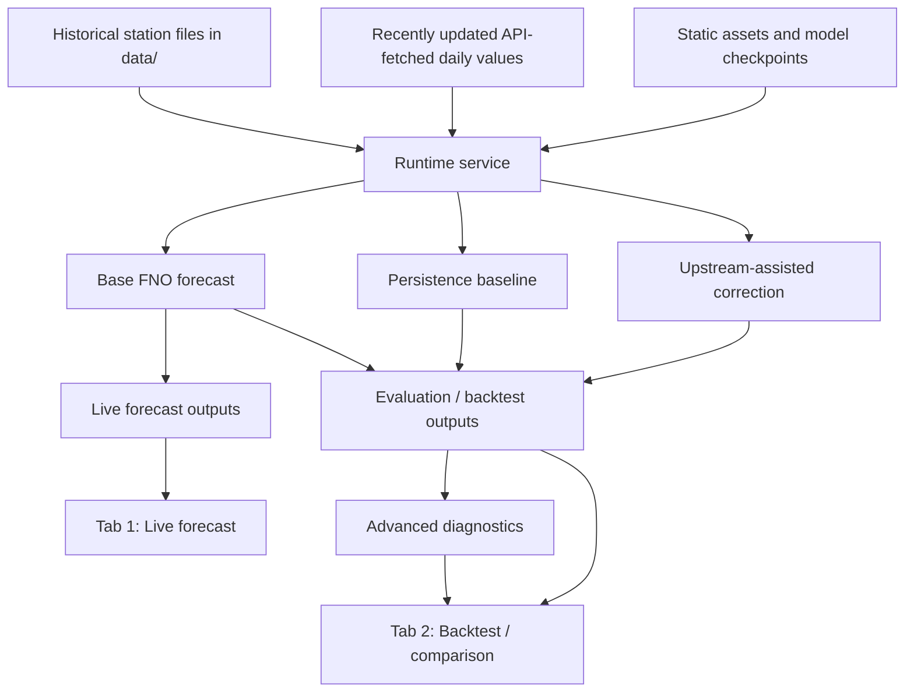

# System Architecture

This document describes the architecture of the Mekong FNO system as a **deployable station-level forecasting and evaluation service**.

The current implementation is designed around a practical operational workflow:

- historical and recently updated daily data are merged into a runtime service
- an FNO-based data-driven core model produces station-level short-horizon forecasts
- upstream-assisted correction layers provide optional forecast refinement
- the same deployed application exposes both:
  - forward-looking live forecasting
  - retrospective backtesting and diagnostics

This page focuses on **how the system is organized**, not only on what results it produces.

---

## 1. Architectural Goal

The architecture is intentionally built to support a system that is:

- **deployable**, not notebook-only
- **reloadable**, not fixed to a single startup state
- **verifiable**, not dependent on offline claims only
- **comparison-oriented**, not limited to a single model curve
- **runtime-aware**, not just a static bundle of source files

In practical terms, the architecture is designed to support a **lightweight station-level operational supplement** rather than a large basin-scale platform.

---

## 2. High-Level View

At a high level, the system has five main layers:

1. **Raw data inputs**
2. **Runtime data service**
3. **Forecasting and correction logic**
4. **Evaluation and diagnostics**
5. **User-facing application layer**

These layers are connected through a cached process-level service object that allows the app to behave like a coherent forecasting system rather than a collection of disconnected scripts.

---

## 3. High-Level Flow

This diagram reflects the current deployed logic:

* raw data are merged first
* forecasting and baseline generation happen on top of the merged service
* evaluation and diagnostics are generated from the same service state used by the live app

---

## 4. Main Architectural Components

## 4.1 Historical Data Layer

The historical data layer provides the core long-range station history used by both:

* live forecasting
* retrospective evaluation

Typical source location:

* `data/`

These data are treated as **project-level source files**, not transient runtime cache.

Primary role:

* provide the longer daily history needed to build model input windows
* define the stable historical backbone for forecasting and backtesting

---

## 4.2 Live / Updated Data Layer

The system also uses recently refreshed daily values obtained through the live/API update path.

These values are used to extend and refresh the most recent part of the daily series so that the deployed application can operate on data that are closer to current conditions.

Primary role:

* refresh the tail of the daily series
* support a current live forecast view
* support updated backtesting up to the latest available date

This makes the app more than a static offline model wrapper.

---

## 4.3 Static Asset Layer

The static asset layer contains files used by inference and evaluation that are relatively stable across runs.

Typical source locations:

* `assets/`
* `weights/`

Examples include:

* model checkpoints
* climatology vectors
* normalization metadata
* phase/evaluation reports
* other precomputed inference or evaluation resources

Primary role:

* provide deterministic model/runtime dependencies
* separate stable project assets from generated runtime outputs

---

## 4.4 Runtime Layer

The runtime layer holds files that are generated, refreshed, or updated during operation.

Examples include:

* live caches
* backfill artifacts
* evaluation caches
* assist parameter caches
* runtime reports

The runtime layer is distinct from project assets because these files represent **operational state**, not static repository content.

Typical behavior:

* on local runs, runtime files live in a project-local runtime directory
* on Hugging Face Spaces, runtime files are written to persistent storage

Primary role:

* support repeated use, refresh workflows, and cache reuse
* make the deployed app operationally stable across sessions

---

## 5. Core Service Architecture

## 5.1 Process-Level Cached Service

The application is built around a cached process-level service object.

This service encapsulates:

* merged target-station daily series
* upstream daily series
* loaded model state
* runtime metadata
* evaluation helpers
* forecast utilities

The UI callbacks do not each independently rebuild the system from scratch.
Instead, they consume this shared loaded service.

This design has several advantages:

* avoids repeated heavy startup logic on every callback
* keeps the app responsive
* centralizes forecasting state
* keeps the UI layer thin

---

## 5.2 Why a Cached Service Matters

Without a cached service, the app would behave more like a script launcher:

* each action would reload data
* each action might rebuild state independently
* consistency between forecasting and evaluation would be harder to maintain

With the cached service design, the app behaves more like a deployed forecasting application:

* one coherent runtime state
* multiple UI paths
* explicit reload behavior when fresh state is needed

---

## 6. Forecasting Layer

## 6.1 Base Forecast Path

The base forecast path uses an FNO-based data-driven core model.

This path is responsible for:

* building rolling input windows
* generating the primary station-level forecast signal
* supporting both live forecasting and backtesting

Important interpretation note:

> the deployed system should not be understood as a pure FNO-only solution

The FNO path is the **core forecast generator**, but the deployed system’s practical value also depends on:

* baseline comparison
* upstream-assisted correction
* evaluation and routing behavior

---

## 6.2 Persistence Baseline Path

Persistence is treated as a first-class baseline in the deployed system.

This is architecturally important because it ensures the application is not designed only to display model outputs, but also to judge them against a strong operational benchmark.

Primary role:

* provide a strong baseline for comparison
* anchor interpretation of model usefulness
* surface horizon-dependent forecasting value

---

## 6.3 Upstream-Assisted Correction Layer

The current system supports upstream-assisted variants using:

* 3S
* Pakse

These are not separate standalone models in the system architecture.
Instead, they function as **correction/refinement layers** on top of the base FNO path.

Primary role:

* refine base station-level forecast behavior
* inject hydrology-informed upstream information
* support comparison-oriented evaluation
* support availability-aware routing

This architecture is one of the most important design choices in the project.

It allows the system to be interpreted as:

> **FNO-based data-driven core + hydrology-informed correction layer**

rather than as a single monolithic model.

---

## 7. Evaluation Architecture

## 7.1 Evaluation in the Same Deployed Application

The evaluation workflow is not separated into a completely different offline stack.

Instead, the deployed Gradio app includes:

* a live forecasting tab
* a backtesting / evaluation tab

This is architecturally valuable because it ties:

* operational use
* historical validation

into the same system boundary.

Primary benefit:

* the system is easier to verify
* the evaluation is closer to the deployed data path
* the application behaves like a forecast service, not just a static visualization

---

## 7.2 Evaluation Layers

The current evaluation architecture includes several levels:

### A. Full-window baseline/model comparison

Used to answer:

* does the deployed assisted system beat persistence?
* does it beat the base FNO path?

### B. Common overlap diagnostics

Used to answer:

* on the same dates, is 3S or Pakse stronger?

### C. Source availability diagnostics

Used to answer:

* how often is each upstream source available?
* how much does coverage affect deployability?

### D. Routed operational evaluation

Used to answer:

* what does the deployed routing policy actually do?
* what is the current full-window operational behavior under source constraints?

This layered evaluation architecture is one of the strongest parts of the current system design.

---

## 8. Application Layer

## 8.1 Gradio UI

The user-facing application is implemented as a Gradio app.

Typical source location:

* `app/app.py`

The UI currently exposes two main operational paths:

### Tab 1

Live station-level forecasting

### Tab 2

Backtesting, comparison, diagnostics, and evaluation interpretation

The application layer is intentionally lightweight.
It is not where the forecasting logic lives; it is where the loaded service is exposed to the user.

---

## 8.2 Why the UI Layer Is Thin

This separation is intentional.

The UI layer should:

* route user actions
* trigger callbacks
* display results
* expose reload behavior
* present evaluation outputs

The UI layer should **not** contain the full forecasting system logic in an entangled form.

This separation improves:

* maintainability
* readability
* testability
* deployment stability

---

## 9. Deployment Architecture

## 9.1 Local Deployment

The project can run locally with:

* project-local runtime directories
* local Python dependencies
* local access to assets, weights, and data

This supports:

* reproducibility
* debugging
* local validation outside hosted infrastructure

---

## 9.2 Hugging Face Space Deployment

The project is also designed to run on Hugging Face Spaces.

In the hosted deployment:

* the app starts from a persistent project state
* runtime outputs are written to persistent storage
* refreshed artifacts can survive across sessions
* the same forecasting and evaluation interface is exposed through the web application

This is important because the project is not merely “compatible with hosting”; it is architected to behave like a real hosted forecasting service.

---

## 9.3 Persistent Storage Design

Persistent storage is important because the application distinguishes between:

* static assets
* runtime-generated operational files

Without this distinction, refreshed artifacts, cached outputs, and evaluation state would be harder to manage consistently in a deployed environment.

---

## 10. Automation Architecture

## 10.1 Scheduled Backfill Publication

The project includes a scheduled workflow for backfill publication.

Typical source location:

* `.github/workflows/publish_backfill.yml`

This workflow helps support:

* updated artifacts
* refreshed data products
* repeatable operational update paths

This is a meaningful part of the system architecture because it extends the project beyond “run once manually” usage.

---

## 10.2 Architecture Role of Automation

Automation is not treated as a separate unrelated devops layer.
It is part of the forecasting system’s operational design.

Its role is to help ensure that:

* data updates can propagate
* artifacts can be refreshed
* deployed evaluation can stay connected to newer runtime state

---

## 11. Design Principles

The architecture reflects several explicit design principles.

### 11.1 Clean separation of concerns

Separate:

* UI logic
* model logic
* runtime logic
* historical source data
* generated operational artifacts

### 11.2 One coherent deployed service

Use one loaded runtime service for:

* live forecasting
* backtesting
* comparison
* diagnostics

### 11.3 Strong baseline awareness

Treat persistence as a first-class baseline, not an afterthought.

### 11.4 Comparison-oriented system design

Do not expose only one forecast curve.
Expose:

* baseline comparison
* assisted comparison
* overlap diagnostics
* availability-aware routing interpretation

### 11.5 Operational realism

Architect the system for:

* refresh workflows
* persistent storage
* hosted deployment
* repeatable use

---

## 12. Current Architectural Boundaries

The current architecture is intentionally **not** a large multi-layer basin-scale platform.

It does **not yet** directly ingest platform-layer outputs as:

* exogenous covariates
* correction targets
* ensemble members
* residual-model inputs

This is intentional.
The current architecture is kept focused on:

> a clean, deployable, and verifiable station-level forecasting service

rather than a partially integrated multi-layer platform prototype.

---

## 13. Future Architectural Extensions

The architecture has natural future extension points.

### 13.1 External platform-layer integration

Future integration may include optional ingestion of:

* basin-scale mechanistic outputs
* platform-layer forecasts
* external scenario or routing signals

Possible architectural roles include:

* exogenous covariates
* correction targets
* ensemble inputs
* residual-model inputs

### 13.2 Expanded assisted inputs

Future assisted-layer inputs may include:

* upstream discharge
* upstream/local rainfall
* other hydrologically informative external variables

### 13.3 Multi-station extension

If the project later expands beyond a single station, the architecture may also evolve toward:

* broader spatial dependencies
* richer external inputs
* stronger shared modeling layers
* physics-informed or multi-station extensions

### 13.4 Static hydraulic / geometric descriptors

A more distant extension path could explore whether static descriptors such as:

* river slope
* channel-width-related priors
* simple hydraulic/geometric metadata

are useful for future multi-station or physics-informed variants.

---

## 14. Architectural Summary

The current Mekong FNO system is best understood as:

> a **deployable station-level forecasting and evaluation architecture**
> built around:
>
> * merged historical/live daily inputs
> * an FNO-based data-driven forecast core
> * hydrology-informed upstream-assisted correction
> * availability-aware diagnostics
> * routed operational interpretation
> * persistent runtime behavior
> * hosted web delivery

Its key architectural strength is not that it is a large forecasting platform.
Its key strength is that it turns a station-level forecasting task into a **coherent, deployable, verifiable operational system**.

---

## 15. Related Documents

* Main overview: [`../README.md`](../README.md)
* Result interpretation: [`results.md`](results.md)
* Evaluation guide: [`evaluation.md`](evaluation.md)
* Future model-selection notes: [`model-selection.md`](model-selection.md)
